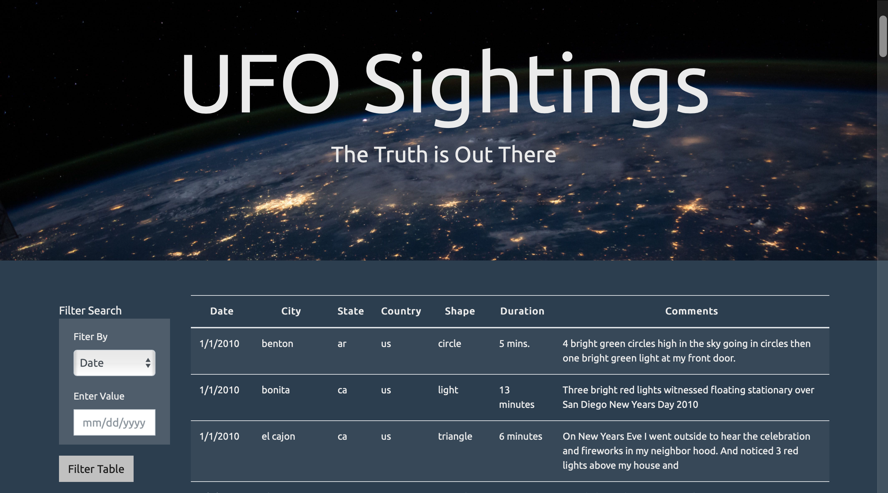

# Javascript-Challenge

 

## Introduction

In this project code was developed to create a table dynamically based upon a dataset that was provided by Tecnologico de Monterrey. The web page allows users to filter the table data for specific values. This web page was developed with pure JavaScript, HTML, and CSS, and D3.js 

## Tools

The following tools were used to developed the web page

+ Javascript 
    + D3
+ HTML
+ CSS

## Data

### Schema

|      Column     |  Data Type |
| --------------- | -----------|
|    datetime     | `datetime` |
|      city       |  `string`  |
|      state      |  `string`  |
|     country     |  `string`  |
|      shape      |  `string`  |
| durationMinutes |  `string`  |

- datetime         -> Date of the sighting
- city             -> City of the sight
- state            -> State of the sight
- country          -> Country of the sight
- shape            -> Shape of the sight
- durationMinutes  -> Duration of the sight

Example:

    [ 
      {
        "datetime": "1/13/2010",
        "city": "white oak",
        "state": "pa",
        "country": "us",
        "shape": "triangle",
        "durationMinutes": "30 seconds",
      }
    ]

Using multiple input tags and/or select dropdowns, users can set multiple filters and search for UFO sightings using the following criteria based on the table columns:

- date/time
- city
- state
- country
- shape

You can reach the web page here: [UFO Finder](https://enr1que319.github.io/Javascript-Challenge/index.html "UFO")

## Screenshots

 

